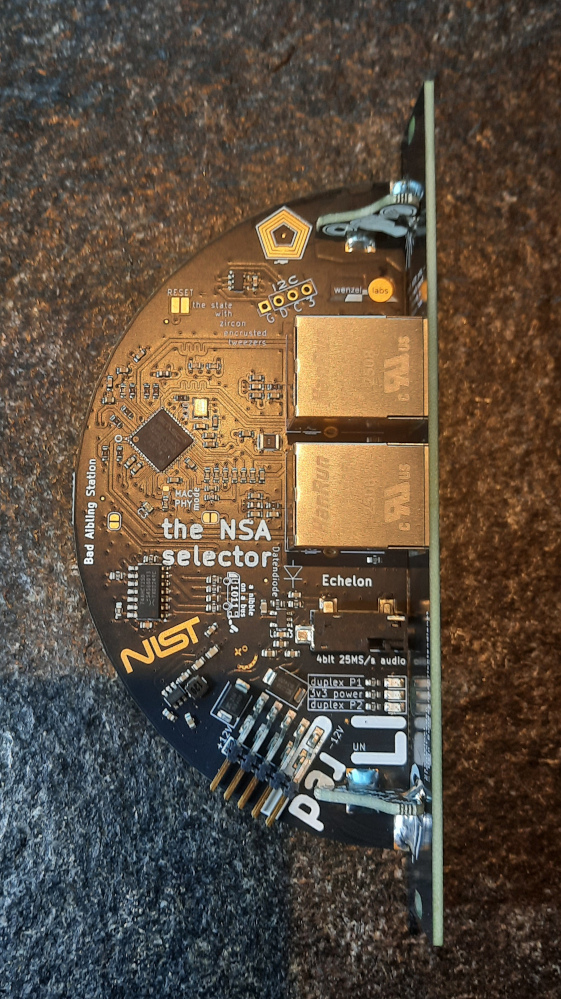
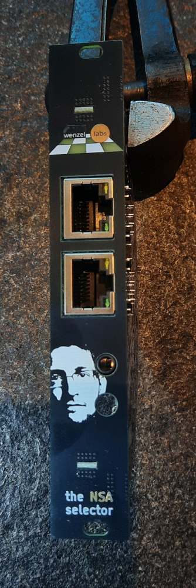
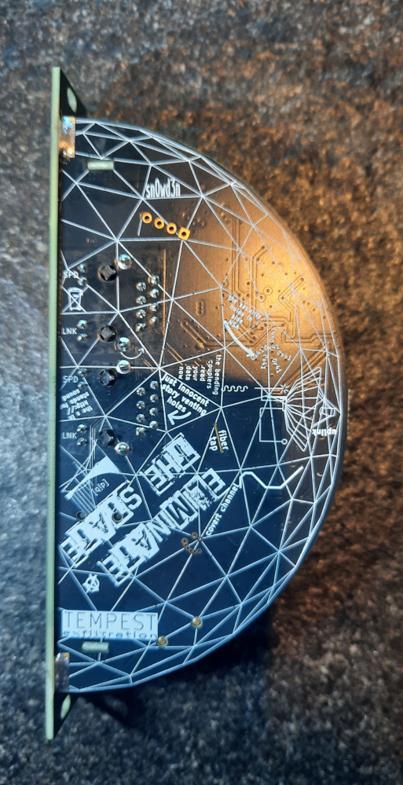
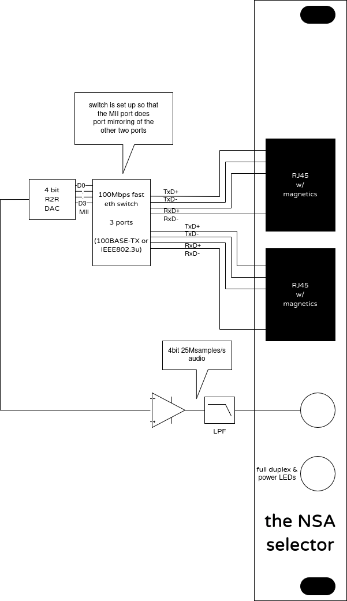
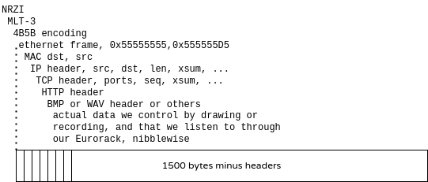

# the NSA selector

you can purchase the NSA selector at [my little shop over at lectronz](https://lectronz.com/stores/wenzellabs).

      

## what is it

the NSA selector is a eurorack module with two ethernet jacks an one audio output.
any bit on the network will be sent to the audio output.

- 4 HP wide
- current consumption:
    -  12V : 100mA
    -   5V : nothing
    - -12V :   2mA

## what it's not

this is not an "audio interface". we do not play back any "format" such as RTP
or MP3 or WAV ot the like. the eurorack module does not "speak" any protocol.
all traffic is forwarded from one network jack to the other unmodified.
it's just tapped, intercepted to convert it to audio.

## examples

watch [the NSA selector video](FIXME)

### sequencer script

in the folder [`sequencer/`](sequencer) you find a very simple shell script, that mimics a
sequencer by network pings of different size.

### plain image transfer

if we transfer uncompressed, unencrypted images e.g. in the .bmp format,
we can hear the pixels. together with a small http server which is available
in the [`fileserver/`](fileserver) folder. you can listen to your photos or drawing from
gimp (or photoshop in case you're a rich musician).

### encode audio to NSA's native format

the NSA selector's native format is 4 bits and 25MS/s which originates from the
typical PHY MAC interface called [MII](https://en.wikipedia.org/wiki/Media-independent_interface).

at first glance 4 bit audio appears to be really crappy, but we can use the
ridiculously high sample rate. what we need is called a delta-sigma modulator.
this lets us convert a simple mono 16 bit 48kHz .wav file to a 4 bit 25MHz
.nsa file.

note that this saturates the link and through the added headers from ethernet,
IP, UDP or TCP and HTTP you'll get artifacts. and happy litte retransmissions.

far from HiFi quality, but the method adds a lot of spice and excitement.

there's a converter in the [`upconverter/`](upconverter) folder.

### network overhead

here's what a network packet can look like on the wire:

and we're listening in on the "4B" side of the "4B5B encoding" layer.
so the first bits we hear are [the preamble of the ethernet frame](https://en.wikipedia.org/wiki/Ethernet_frame#Preamble_and_start_frame_delimiter) and we follow up the stack. e.g. ethernet, IP, TCP, HTTP, BMP.

### delay, oversaturation

there's a neat little idea I had during development to add a delay to say a
sequencer pattern. actually it's more like an echo than a delay since it lacks
precise timing control.
ssh log into the remote machine that creates the e.g. ping traffic. then dump
the network traffic to the text console to double it. you can increase verbosity
levels of the dump to crank up the echo until total saturation of the link
and lost captured packets. see the video if this explanation is not clear to you.

commands I usually use:

`tcpdump -ni eth0`

`tcpdump -nvi eth0`

`tcpdump -nvi eth0 icmp`

`tcpdump -nvxi eth0`

`tcpdump -nxi eth0`

`tcpdump -nxi eth0 not port ssh`

### other network traffic

be creative!

there's so much I hadn't been listening into, like

- online games - I guess a wide variety is waiting here, and some will be very distinctive
- doomscrolling on the various platforms
- network backup
- IoT stuff
- remote desktop protocols
- write your own code
- bundle together ping, netcat, socat, nmap and whatnot and make them MIDI controllable through a software registered MIDI client

if possible disable encryption, then you can profit from not only timing
pattern (of white noise), but also listen in on the plaintext payload.
the NSA loves plaintext.

## the tech bits

the NSA selector is a fast ethernet (FE=100Mbps) network switch with three
ports. the two front ports are switched, and the third port is only available
internally as 4 bit MII bus. it is configured as mirror port of the two front
ports and wired to a 4 bit DAC and a low-pass-filter.

## assembling the kit

both versions are available in my store, a fully assembled eurorack module
and a kit version where you have to solder on the front plate.

watch my [NSA selector kit assembly](https://www.youtube.com/watch?v=SXlfyeYuZuQ) video on youtube.

## store

you can purchase the NSA selector at [my little shop over at lectronz](https://lectronz.com/stores/wenzellabs).

##### SEO
#eurorack #theNSAselector #wenzellabs
